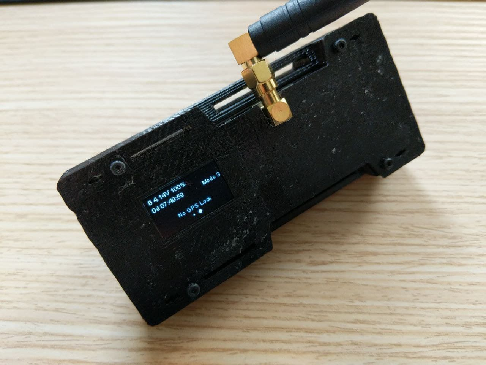
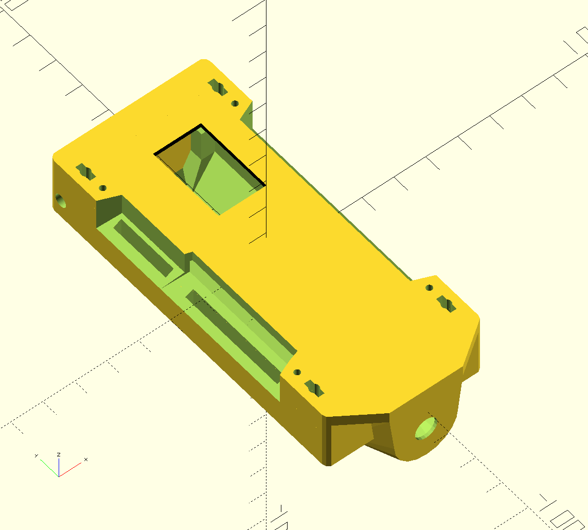
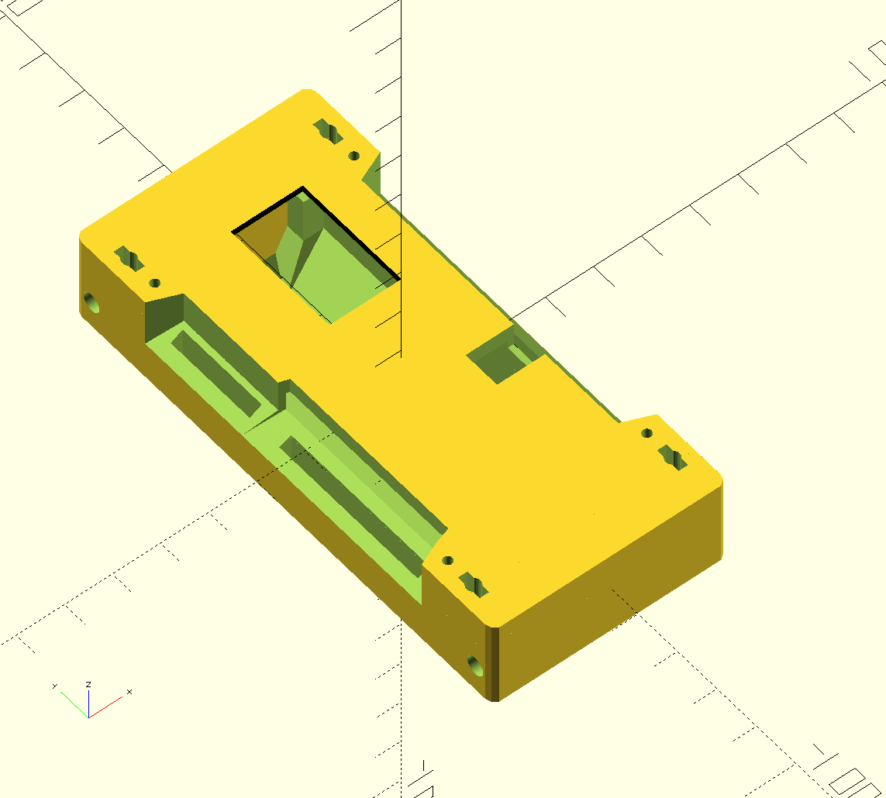

# ttgo_tbeam_openscad_case

Openscad case for LIlyGo TTGO T-Beam boards
supporting both SMA and IPEX antenna versions.

**Contributions welcomed, feel free to send a push request for considerations. Build process improvements... new hardware revision supports**

This was created to bring together various good ideas I seen in various cases but aiming for ease of printing

Also targeting:

* Hight tolerances for loose 3D printers
* Slits for mounting straps
* Support both IPEX and SMA antenna style
* Support OLED
* Support both zip tie or M3 or M2 screws to hold case together
* Able to prop device at an angle to view screen on desk easily

## Supported HW Board revisions to folder revisions

* `20191212 t22_V1.1` in lilygo_ttgo_tbeam_case_20191212_t22_V1_1

# Case examples

## 20191212 t22_V1.1

### IPEX

### SMA

# Improvements considerations for the future

* Add a grill on top of OLED screen to prevent screen damage
* Add buttons as an option to help reduce enviromental ingress damage.
* Make a version that is enviromentally sealed (no buttons perhaps) with rubber seals (But how to charge?)
* Allow for various GPS antenna style and mounts

# Building

Requires linux or windows running linux subsystem.

# Related links

* https://meshtastic.discourse.group/t/what-3d-printed-case-to-use-with-ttgo-t-beam-t22-v1-1/564/3 What 3D-printed case to use with TTGO T-beam (T22-V1.1)